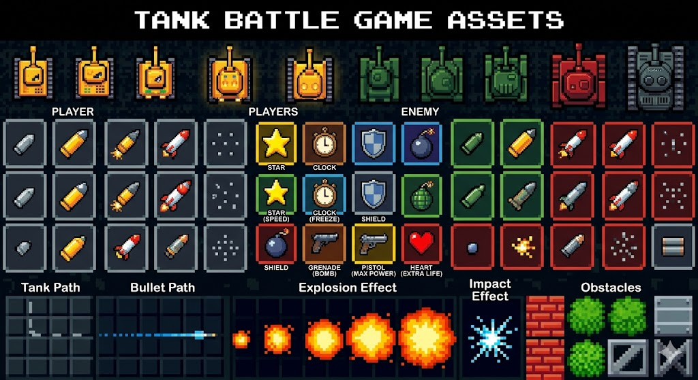

# TANK DAI CHIEN - ULTIMATE EDITION

A Battle-City-inspired arcade tank shooter built with Python + Pygame, featuring
themed maps, boss fights, an in-game shop, weather effects, an auto-play mode
backed by A\*/BFS/DFS pathfinders, and a tier-based player upgrade system.

> Procedural sprite engine — every tank, tile, bullet, explosion and item is
> drawn at runtime by `sprites.py`, no PNG assets required.

## Asset reference

The art direction follows the reference asset sheet shipped under
`assets/tank_battle_assets.png`:



## Requirements

- Python 3.9+
- See [`requirements.txt`](requirements.txt)

## Install & run

```bash
pip install -r requirements.txt
python tank_game.py
```

The game launches fullscreen by default. Set `TANK_WINDOWED=1` to start in
windowed mode (useful for debugging), or press **F11** at any time to toggle
fullscreen:

```bash
TANK_WINDOWED=1 python tank_game.py
```

## Controls

| Key | Action |
| --- | --- |
| Arrow keys / WASD | Move tank |
| Space | Shoot |
| Enter | Confirm / Start / Continue |
| Esc | Pause (in game) / Back |
| F | Toggle AUTO mode (AI plays) |
| G | Cycle AUTO algorithm (A\* / BFS / DFS) |
| 1 / 2 / 3 | Use backpack item slot |
| H | Tutorial (from title) |
| F11 | Toggle fullscreen |
| 0–9 | Buy items (in shop) |

## Game features

- **6 themed maps** rotating per level: default, desert, jungle, snow, city,
  lava — each with matching weather (snow, sand, rain, embers).
- **Boss fight every 5th level**.
- **Player tier system**: collecting weapon upgrades visually evolves the
  player tank through 5 tiers (yellow → gold → orange → red-orange →
  premium chrome). Tier persists across levels until you die or restart.
- **Items** (drop from crates / break bricks / random spawn):
  - `health` `+1 HP`
  - `life` extra life
  - `shield` +3 shield charges
  - `speed` refill energy bar
  - `rapid` rapid-fire burst
  - `multi` 3-way spread shot
  - `pierce` piercing bullets
  - `bomb` explosive bullets
  - `laser` laser beam
  - `plasma` plasma shots
  - `star` screen-clear bomb
  - `freeze` ❄ freeze every enemy on screen for ~5 seconds
  - `max_power` 🔫 instantly upgrade your tank to max tier (max HP, fastest
    fire rate, piercing rounds, +3 shield)
  - `grenade` 💣 AOE explosion centered on the player (radius ≈ 4 tiles)
- **Shop** (entered between levels) where you can spend earned money on items
  added to your 3-slot backpack (keys `1` / `2` / `3` to use them).
- **AUTO mode** (`F`): an AI takes over your tank using one of three
  configurable pathfinders.
- **Visual polish**: animated water tiles, weather particles, screen shake,
  smooth camera, achievement popups, floating combat text, minimap, premium
  procedural sprites with material/gloss/bevel effects.

## Project layout

```
.
├── tank_game.py       # Main game loop, state machine, gameplay logic
├── sprites.py         # Procedural sprite engine (tanks, tiles, items, FX)
├── nhacnen.mp3        # Background music
├── assets/
│   └── tank_battle_assets.png   # Art reference sheet
├── requirements.txt
└── README.md
```

## License

This is a hobby/educational project — no formal license file. Treat it as
"all rights reserved" unless the author specifies otherwise.
